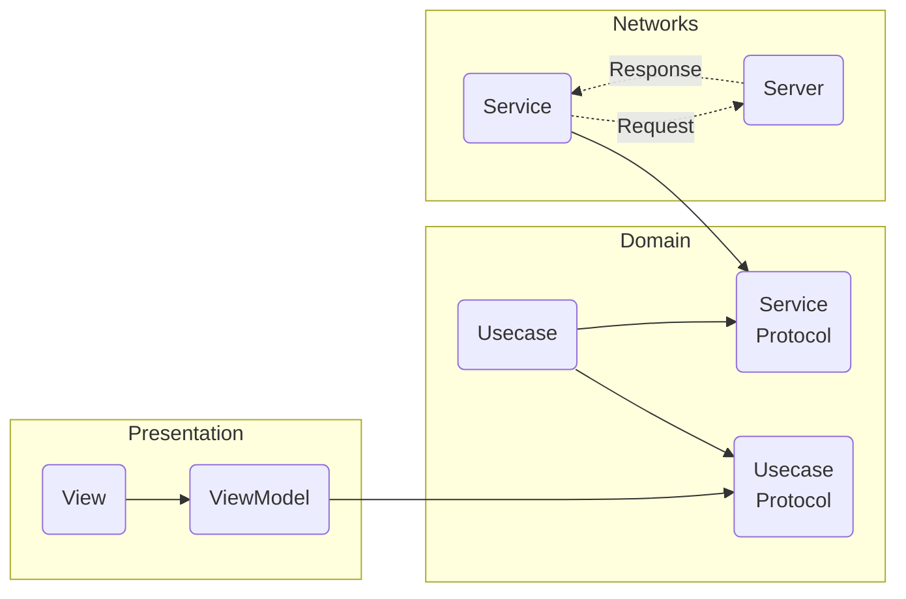

## fooiy - 내 손안의 음식점 
> `2022.04 ~ 2022.12` [앱스토어 바로가기](https://apps.apple.com/kr/app/푸이-내-손안의-모든-음식점/id1640024571)

평점이 높아서 방문한 맛집이 막상 내 입맛과 맞지 않아 실망했던 적이 있으신가요?  

푸이는 이러한 문제를 해결하기 위해, 평점 기반의 리뷰에서 벗어나 사용자의 입맛 성향을 분석한 'FooiyTI'를 기반으로 리뷰를 남기고  

유사한 입맛의 사람들이 선호한 음식점을 추천해주는 서비스입니다.  

  

 

### 🛠️ 개발 환경 및 라이브러리
      
`NaverMaps` `Firebase` `Lottie`
               
  

  
## ✨ 기능 소개

### 푸이티아이

질문지를 통해 푸이티아이(입맛 성향)를 분석할 수 있습니다.

  

  
푸이티아이 자세히 보기

  
  

  > 🧾 푸이티아이

  
  
  
  

  

  

### 개척/기록

음식 사진과 평가를 등록하여 음식점을 기록할 수 있습니다.

  
개척/기록 자세히 보기

  
  
  
  
  
  

  

### 음식점 지도

맛집에 대한 정보와 푸이티아이를 기반으로 만족할 확률을 지도상의 마커로 보여줍니다.  
카테고리, 지역별 필터링을 적용할 수 있습니다.  
맛집을 검색할 수 있습니다.

  
음식점 지도 자세히 보기

  
  
  
  

  

### 피드

사용자가 기록한 맛집에 대한 정보를 피드로 볼 수 있습니다.  
지역 필터링을 적용할 수 있습니다.

  
피드 자세히 보기

  
  

  

  

## 📚 스킬

### Clean Architecture + MVVM

- Presentation, Domain, Network Layer로 분리하여 각 Layer의 역할을 나누었습니다.
- MVVM 패턴으로 UI 로직과 비즈니스 로직을 분리했습니다.

 

### RxSwift
연속된 escaping closure를 피하고, 비동기처리를 직관적으로 구현하기 위해 RxSwift를 사용하게 되었습니다.

 

### Server Driven UI
푸이는 배포 초기에 UI 기획 변경이 잦아 반복적인 배포 과정이 비효율적이었습니다.   
변화하는 기획에 유연하게 대응할 수 있는 구조가 필요했기 때문에 서버에서 내려주는 데이터에 따라 UI를 구성하는   
Server Driven UI를 도입하여 배포 없이도 화면 수정이 가능하도록 개선했습니다.

 

### PHPicker
리뷰를 등록할 때마다 음식점의 주소를 지정해야하는 것이 번거롭다는 사용자의 피드백이 있었습니다.   
이를 개선하기 위해 사진의 메타 데이터에서 촬영 장소를 추출하여 음식점 주소를 지정해야하는 번거로움을 덜어냈습니다.

  

### 💪  **담당 기능**
* 푸이 iOS 앱 개발 및 유지보수
  - `온보딩`: 버전 체크 및 FCM토큰 갱신 페이지 개발
  - `로그인/회원가입`: KakaoSDK 활용하여 개발
  - `음식점 지도`: NaverMap을 활용한 음식점 조회 기능 개발
  - `음식점 기록`: 음식 사진 업로드 기능 개발
  - `게시물 수정`: 게시물 수정 기능 개발
  - `유저 검색`: 유저 검색 기능 개발

  

## 📈  **성과**

정기적인 업데이트로 사용자의 참여도가 높아진 것을 확인
- **사용자 수**: 902명 -> 1467명으로 증가
- **평균 참여시간**: 13분 11초 → 17분 47초로 증가
- **참여 세션(화면) 수**: 1.8 → 2.6으로 증가
- **세션당 평균 참여 시간**: 4분 13초 → 5분 25초로 증가

  

### 🔗  링크
- **홈페이지**: [fooiy.com](https://fooiy.com)
- **머니투데이 기사:** https://news.mt.co.kr/mtview.php?no=2022091716551984413
  
  
